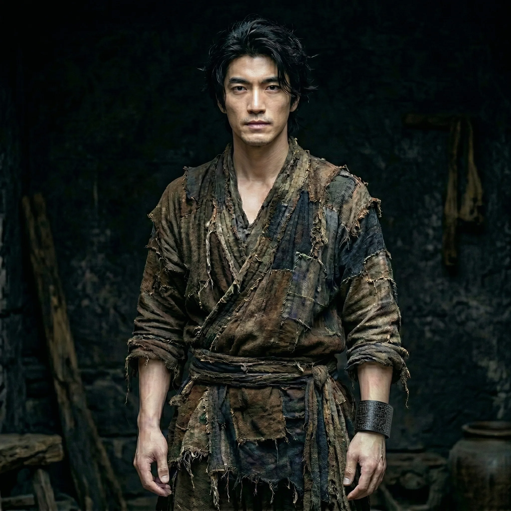

# Lu Chen (Lin Mo)

*   **Alias**：**Sun Mancang → Lin Mo → Lu Chen · Undying Soldier · Civilizational Mentor**

Born Sun Mancang in 1933 in Henan, China. In 1945, burned inside Unit 731's incinerator, he mutated — gaining quantum-state reset: undying. In 2056, as humanity's last stand, the only carbon-based lifeform capable of surviving a spacetime leap was sent through the time corridor. After enduring 74,000G tidal forces, he crashed into the mountains of the Southern Song Dynasty. His body rebuilt from zero, his memory shattered — but every muscle fiber was carved with the killing instincts of a 2056 extreme special-forces soldier. Rescued by widow Lu Xiaoxiao, he began rewriting the course of civilization under the name 'Lu Chen.'

## 0. Name & Identity Evolution

*   **Birth name**: **Sun Mancang** (1933, Henan, China — a grounded peasant name of the era)
*   **Camp serial number**: **0713** (Unit 731 top-secret experimental subject code)
*   **Wasteland soldier callsign**: **Lin Mo** (given by the 2056 wasteland survey team; means 'silent as a forest')

## 1. Appearance: The Cold Wasteland Wolf

*   **Physical intimidation**: When Lu Chen first appears in the Song Dynasty, he radiates a profoundly incongruous aura. Despite wearing coarse hemp clothing, nothing can conceal the extreme physique forged on the 2056 wasteland battlefield. Knotted veins, minimal body fat — even at rest he radiates lethal intent.
*   **Cyber brand**: Clamped to his left wrist is a matte-black 'dimensional bracelet,' creating a violent visual contrast against his tattered ancient garb. This bracelet is the totem of hard sci-fi colliding with cold-weapon civilization.
*   **Divine and bestial**: His eyes hold none of a scholar-official's warmth — only a trench veteran's absolute cold calm and extreme alertness to threat.

## 2. Origin: The Unit 731 Incinerator Mutation

August 1945. In Unit 731's final frenzy before retreat, experimental subject 'Sun Mancang' was thrown into a giant incinerator. In the absolute despair of the flames, certain unknown physical constants were inverted.
He reconstituted flesh and blood at the edge of being carbonized to bone. This event granted him the forbidden ability of **'undying (quantum-state reset)'** and permanently locked his brain's neural topology. He lay dormant like a beast in the scorched earth of Central China for decades, until his consciousness fully awoke in 2056, ultimately arriving in the Southern Song of 1140 CE via a spacetime leap.

## 3. Core Abilities: Quantum Reset & Combat Intuition

### 1. Undying Body (Quantum Reset)
*   **Effect**: No matter what physical lethal blow is dealt, his body forcibly reverses entropy increase, drawing environmental energy from deep within his bones to reconstitute itself.
*   **Limitation**: Due to neural synapse loading lag, each recovery after severe brain trauma is accompanied by severe amnesia and logical confusion. **This ability is absolutely non-heritable.**

### 2. Muscle Memory & 'Kill Prediction'
*   **Peak instinct**: He has experienced tens of millions of death-level special operations training simulations in a 2056 secret research facility. Though logical thinking is impaired during 'amnesia periods,' his combat instincts remain on 'full-time standby.' The moment hostility or a blade is detected, his muscles explode into the most effective, most ruthless killing response — before his brain can react.

## 4. Knowledge Base: 2056 Industrial Dimensional Strike

Even without relying on alien advantages, Lu Chen himself is a living 'wasteland survival encyclopedia.' As the post-war Earth civilization's top warrior, he masters various foundational industrial technologies:
*   **Primitive military industry**: Coke smelting, steel decarburization, gunpowder granulation, high-purity alcohol distillation.
*   **Modern mechanical weapons**: He can hand-forge, in a Song Dynasty smithy, top-grade cold weapons meeting modern field special-forces standards of ergonomics and material strength.
*   **Field medicine**: Understanding of wound debridement and basic anti-infection far exceeding the Song Dynasty era.

## 5. Initial Equipment: Alien Spatial Bracelet

This is the most powerful 'cheat item' Lu Chen carries — and humanity's final trump card in 2056.
*   **Function**: An absolutely vacuum, time-stopped, high-dimensional folded warehouse.
*   **Current status**: Due to the protagonist's memory fragmentation from the spacetime crossing, the unlock code is in a 'data lockdown' state, requiring gradual unlocking of core compartments through the story (agriculture, mother machine, energy).

## Appendix: Story Log

*   **Shaoxing Era, Twelfth Month**: Falls from the 2056 battlefield into the mountains of the Southern Song. Body quantum-reconstituted from surviving stem cells, memory completely blank. Rescued by Lu Xiaoxiao and brought back to the village.
*   **Twenty-first of Twelfth Month**: Wakes in Lu Xiaoxiao's broken-down house. Activates instinctive observation mode, anchoring rescuer Lu Xiaoxiao as 'high-priority survival signal source.'
*   **Night of Twenty-fourth**: Witnessing Lu Xiaoxiao beaten and bleeding by village bully Wang San instantly triggers subconcious special-forces combat and body-dismantling instincts. Three assailants killed in three seconds.
*   **Around Start of Spring**: Relocates with Lu Xiaoxiao to the deep mountains. Minimal language recovery (single phonemes appearing). Due to hippocampus failing to integrate overloaded wasteland-era memories, recalling them causes neural-damage-level agony. Displays superhuman hunting skills.
*   **After Start of Spring (Post Road Battle)**: Leaps like a hawk into a Song supply convoy surrounded by bandits. Using a broken axe and seized weapons, displays cross-era CQB close-combat technique — single-handedly dismembering 30+ hardened brigands (including one-eyed chieftain), causing hundreds of bandits to psychologically collapse and flee.
*   **After Start of Spring (Camp Integration)**: Enters the Zhezhong Right Camp with the main force, registered under the identity 'unpapered new recruit foot scout' (Lu Chen). First night: sits motionless all night, instinctively scanning the camp layout, recording the smithy location and granary structure. The bracelet shudders once.
*   **Fifth Day After Start of Spring (Zhang Xian's Inspection)**: Zhang Xian stops before Lu Chen during troop inspection, examines his palm muscle groups, notices the bracelet but does not question it. Orders guard Qian Yi to spar — Lu Chen ends it by tapping Qian Yi's ribs with a wooden staff in thirty breaths. Zhang Xian asks 'Where have you fought?' Lu Chen answers 'I don't remember, but I remember how.' Assigned to accompany the Zhezhong Main Camp for three months. The bracelet shudders the longest and deepest yet.
*   **One Month After Assignment (First Combat Wound)**: Veteran Xiang Degui reveals his true weakness: peerless solo, certain death in formation battle. Lu Chen accepts this and begins learning formation tactics. In a five-man scout mission, shot in the left shoulder by a fleeing archer (arrow three inches deep, broken off inside). Abnormal healing speed draws the medic's attention. Lu Chen does not acknowledge it. The bracelet pulses with a clear heartbeat rhythm for the first time, and the first memory fragment surfaces: a single character — 'Sun.'
*   **Late Spring of Shaoxing Year 11 (Official Enlistment)**: Three-month training period ends. Xiang Degui marks final recognition with a tattered 'Yue' banner and the words 'That'll do.' Zhang Xian summons Lu Chen, formally grants him front-army scout rank. Lu Chen's first concern is confirming Xiaoxiao's right to follow the army, accepting the appointment with 'Na zhong' (That works). That night, waking from a dream, a complete memory fragment surfaces: **Sun Mancang** — two characters, clear, carrying the quality of yellow earth and sorghum, more ancient than any known name. The bracelet shudders lightly as he grips the name, as if recognizing it.
*   **Current Status**: [x] Chapter 7 complete. Identity: Yue Family Army front-scout Lu Chen, wife Lu accompanies the camp. Now knows his second name 'Sun Mancang.' The peace treaty momentum is set. Stands beneath the Yue banner, beginning a new phase.
