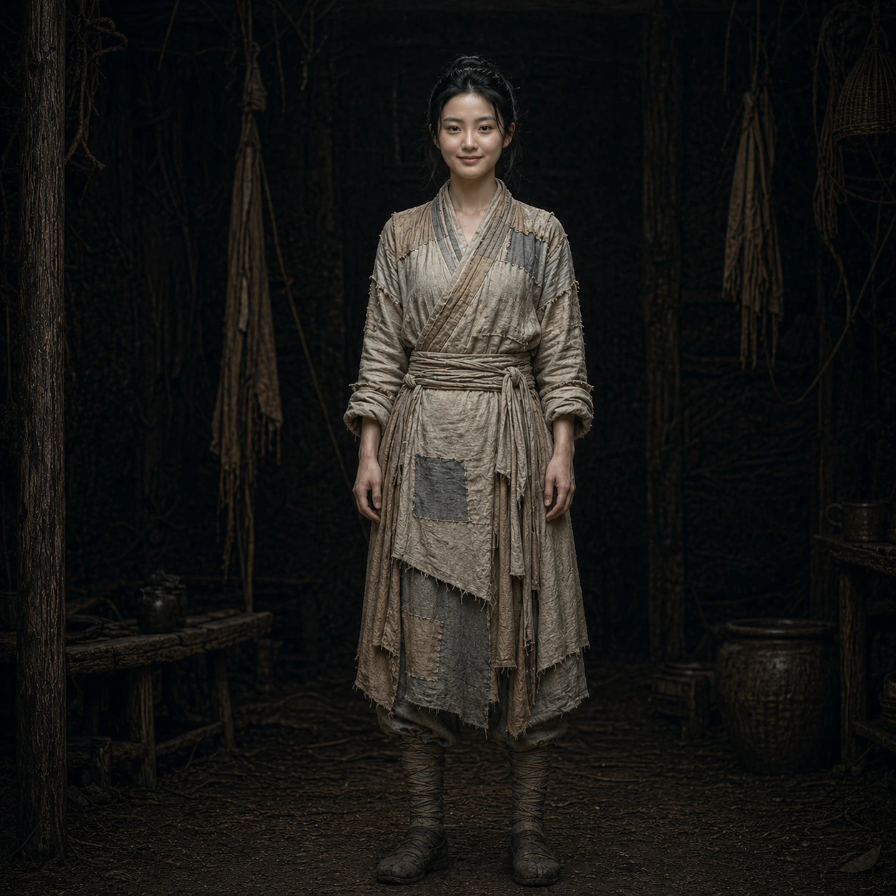

# Lu Xiaoxiao

*   **Alias**：**Merchant's Lost Pearl · Village Widow · Soul of Industrial Logistics**

A 19-year-old daughter of a fallen merchant family, struggling to survive under her clan's predatory pressure. As the protagonist's first protector after arriving in the Song Dynasty, she uses tenacity and survival instincts beyond her era to carry back — from a pile of corpses — the spark that will ignite a new civilization.

## 0. Name & Identity

*   **Name**: **Lu Xiaoxiao**
*   **Age**: 19
*   **Background**: Daughter of a fallen merchant family
*   **Village address**: Zhang-shi / Widow Zhang (from her brief betrothal to blacksmith Zhang Tie)

## 1. Appearance: The Misfit Village Brightness

*   **Visual contrast**: Sweet-featured, fair-skinned, with the refinement of a merchant family in every gesture — a stark, jarring contrast against the rough, weather-worn village women around her.
*   **Fragile disguise**: This 'incongruous beauty,' after losing her parents' protection, became a source of jealousy and predation. She often wraps herself in worn hemp cloth, trying to conceal an undeniable vitality and delicacy.

## 2. Background: Clan Inheritance-Eating Orphan

*   **Sacrificed marriage**: After her parents died, she was sold by her greedy distant aunt to blacksmith **Zhang Tie**.
*   **Man-made hell**: On her wedding day, through the schemes of village ruffians, the groom was seized overnight by soldiers for conscription and died in battle. At only 19, she was cursed as a 'husband-killer unlucky star.'
*   **Survival at the edge**: Forced to a broken-down house at the mountain's edge, under clan predation, she even dared to enter the deep mountains alone to carry back a 'corpse' in order to survive.

## 3. Core Character: Extreme Pragmatism & Survival Gamble

*   **Tenacious as reeds**: In an abandoned-by-heaven desperate situation, she has forged an extremely pragmatic — even somewhat cold — survival instinct.
*   **Wild gamble**: Taking in the naked protagonist was initially not from pity, but from needing a 'man' to hold up a facade and deter the hooligans and greedy uncles who kicked in her door at night.
*   **Lies & shelter**: To keep the protagonist, she could lie without flinching to the local headman — fabricating a 'mute distant cousin' — displaying exceptional adaptability.

## 4. Core Role: Early Salvation & Industrial Logistics Master

*   **Survival anchor**: She is the protagonist's first protector upon arriving in the Song Dynasty, providing initial legal identity cover for the unconscious protagonist.
*   **Soul of logistics**: Using the financial talent and coordination ability inherited from her merchant family, she will, after the protagonist's rise, be responsible for the absolute loyalty baseline, grain and finance coordination, and civilian-operation of the primitive munitions factory for the protagonist's entire group.
*   **Complementary with the Second Female Lead**: She is the protagonist's safe harbor and internal affairs chief, forming with the politically-legitimate princess the protagonist's unbreakable 'civilian-military dual-core advisory team.'

## Appendix: Story Log

*   **Shaoxing Era, Twelfth Month**: Enters the mountains and encounters the fallen Lin Mo — bravely carries this 'tall, heavy, and naked' body back to the village as a stake against the ruffians.
*   **Twenty-third of Twelfth Month**: Spreads the lie of 'mute distant cousin from afar' externally, beginning the two-person cohabitation cover.
*   **Twenty-fourth**: Wang San enters the house violently demanding poll tax and attempts assault, leaving her severely injured. Witnesses Lin Mo descend like an asura — disassembling and killing with precision. That night, to protect the entire village's lives, is forced to flee with Lin Mo, beginning a wartime exodus.
*   **After Start of Spring (Leveraging the Situation)**: Witnesses Lin Mo's asura-like battle formation slaughter from a cliff. With sharp political acumen, seizes the opportunity — lies to rescued Song camp officer Li Dehai that Lin Mo is 'her husband, unjustly harmed and suffering amnesia.' Uses the life-saving debt to exchange for the qualification to gamble on a military registration in the army camp, displaying exceptional advisor-level maneuvering.
*   **After Start of Spring (Camp Layout)**: Enters Zhezhong Right Camp as 'army-following family,' living in a broken oil-cloth tent between the fire-head soldiers' and smithy's paths. After observing camp personnel composition, judges: the entire camp's militia combat power is feeble, and once Lu Chen's strength is exposed it will inevitably attract attention. After the grain-moving incident, tightens defenses and instructs Lu Chen to 'do it but don't overdo it.' That night, proactively visits Li Dehai to gather intelligence: General Zhang Xian will inspect troops within three days, and those selected can be filed separately — faintly sensing a larger path of advancement.
*   **Fifth Day After Start of Spring (Bone-Reading Day)**: Observes Zhang Xian's inspection fully from the shadow of an earthen wall, judges Zhang Xian has exceptional 'people-reading ability' — a chess piece worth using. After Lu Chen is assigned, talks with Lu Chen at night, advising 'let them see you can fight, don't let them see you can think.' Upon learning Lu Chen has a vague sense of Zhang Xian's fate, responds 'I know, so we need to move fast' — already clear-eyed about the direction of history, beginning to plan a higher-level advancement path.
*   **One Month After Assignment (Information Accumulation Period)**: Acts in the rear of Zhezhong Main Camp as army-following family, continuously observing camp information flows — trading a piece of salted jerky for the intelligence source of 'Jin cavalry 20 li to the north.' When Lu Chen returns wounded from mission, her first reaction is to confirm whether Xiang Degui saw the entire injury process (information security consciousness). Upon learning Lu Chen surfaced the memory fragment character 'Sun,' begins reassessing possibilities for Lu Chen's identity origin.
*   **Late Spring Shaoxing Year 11 (Chessboard Extension)**: Upon learning Lu Chen is formally enrolled in the Yue Family Army front scouts, and the peace treaty document spreading that day, begins pushing her strategic objective to 'farther than this banner, farther than Shaoxing Year 11' — no longer relying solely on Zhang Xian as a single pillar, but planning to jump to the next higher foothold before this pillar falls. Has established in camp: two merchant convoy leader intelligence sources, a network with three veteran wives, a camp material flow node map (who controls grain/armor/medicine/communication).
*   **Current Status**: [x] Chapter 7 complete. Intelligence network fully established in Zhezhong Main Camp. Strategic objective pushed to beyond Shaoxing Year 11. Planning to find the next higher foothold amid the aftershocks of the peace treaty.
