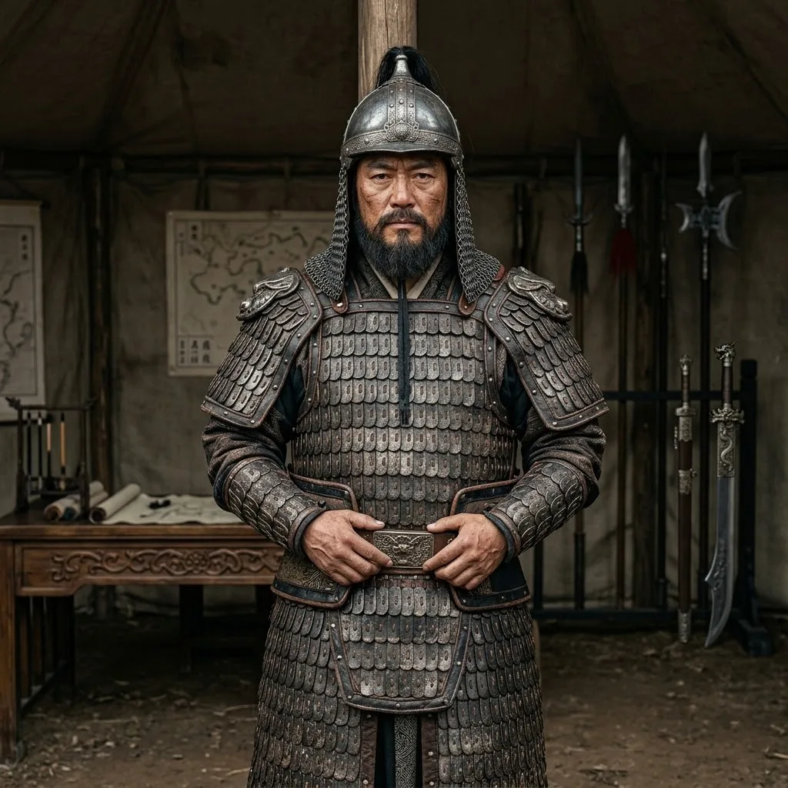

# Zhang Xian

*   **Alias**：**Yue Family Army Deputy Commander · First General · Lu Chen's Military Mentor**

A renowned general of the Southern Song's anti-Jin resistance and the foremost warrior under Yue Fei. His military expertise is exceptional — the central bridge through which Lu Chen enters the grand strategic theater of the Southern Song. Behind his extreme military discipline stands a true professional soldier, and Lu Chen's guide on the cold-weapon battlefield.

## 0. Role (Anchor)

- **Identity**: [Historical figure] Southern Song anti-Jin general, Yue Family Army Deputy Commander (First General).
- **Relationship**: Lu Chen's military guide and mentor.
- **Narrative function**: As a 'professional soldier,' he scrutinizes Lu Chen's monstrous combat power — the central bridge through which Lu Chen enters the Southern Song's grand strategic theater.
- **Status**: Around 30-40 years old during the Shaoxing era, at the peak of his military career.

## 1. Physical Profile

- **Physique**: Tall and balanced, slightly bronzed skin, callused hands from years of wielding a heavy spear.
- **Expression**: Eyes like bright stars, extremely composed, emotions never showing on his face.
- **Equipment**: Iron spear, step-infantry armor, short crossbow at the waist (historically restored).

## 2. Behavior & Combat Style

- **Military discipline paramount**: Extremely rigorous, maintaining proper posture even in private settings.
- **Reading people**: Unlike ordinary generals who worship 'inner power' or 'divine strikes,' he believes in 'speed breaks all' and 'extreme force' — the exact logical foundation on which he recognizes Lu Chen's value.
- **Formation master**: Expert at using local terrain for lethal ambushes.

## 3. Core Character & Conflict

- **Iron rule of loyalty**: His loyalty is not only to Yue Fei, but to the greater cause of 'protecting the borders and the people.'
- **Righteous cause vs. blind loyalty**: When facing the Shaoxing Peace Treaty and the fabricated charges, his choices will become the protagonist Lu Chen's greatest psychological shock — watching his mentor die for loyalty, or using future means to shatter history.

## 4. Key Assets & Faction Relations

- **Yue Family Army front-force commander**: Controls the elite 'front force,' the sharpest blade on the entire anti-Jin front line.
- **Bracelet connection**: Though puzzled by Lu Chen's 'dimensional bracelet,' he has never attempted to seize it due to Lu Chen's military contributions — and uses his authority to cover for Lu Chen.

## 5. Story Log

- **After Start of Spring, Shaoxing Year 11 (Zhezhong Right Camp Inspection)**: Arrives at Pingjiang Prefecture's Zhezhong Right Camp for routine inspection with five bodyguards. Most soldiers disappoint him. Stops before Lu Chen in the lineup, judges his combat experience through palm muscle groups and tendons, notices the left-wrist bracelet but asks nothing. Orders guard Qian Yi to spar — ends after thirty breaths with Lu Chen's victory. His first words to Lu Chen are only 'Where have you fought?' Accepts 'I don't remember, but I remember how' without further questions. Assigns Lu Chen via Li Dehai to accompany Zhezhong Main Camp for three months, family allowed to follow.
- **Late Spring Shaoxing Year 11 (Official Enlistment of Lu Chen)**: Three-month training period ends. Summons Lu Chen, grants formal front-army scout rank in the simplest possible manner. The only change in expression comes when Lu Chen's first concern is 'my wife.' When Lu Chen asks 'Is the peace treaty real?' Zhang Xian answers 'It's real' — after which the tent is silent for a long time. This is the closest he comes to outwardly exposing his inner response to history's verdict. Receives the Lin'an peace treaty document, reads it alone late at night — a silent footnote to his bearing of political pressure.
- **(Continuing) The conflict of righteous cause vs. blind loyalty**: As the Shaoxing Peace Treaty advances, Zhang Xian will face greater pressure of choice.

## Appendix: Historical Research Notes

- **[Think Tank Research]**: Zhang Xian has limited records in the Song History but is of supreme importance. He was Yue Fei's most relied-upon man — even the Jin people said 'It's easier to shake a mountain than to shake the Yue Family Army,' and Zhang Xian was that very mountain.
- **[Writer Team Notes]**: He must be a 'silent hero.' He doesn't need many lines — his presence registers through the professional composure that even makes protagonist Lu Chen feel deep respect.
