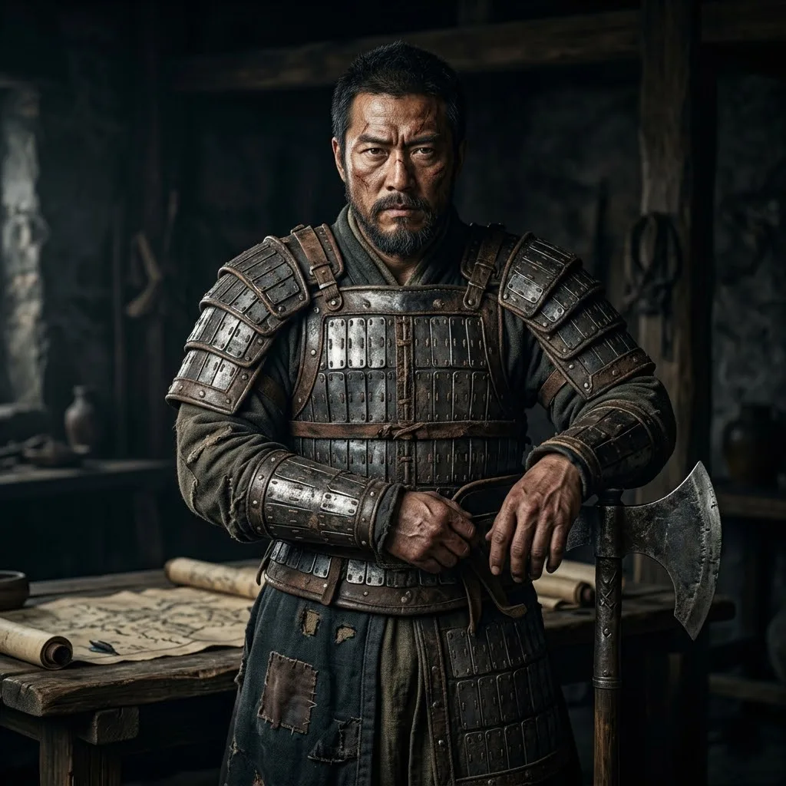

# 03_核心配角_将领_李显忠

*   **本名**：**李显忠**
*   **大宋化名**：**归正人领袖 · 铁血狂人 · 实战先锋**

原名李世辅，归正人将领。身负家仇国恨，从金国杀回大宋。他性格豪放且不拘一格，是陆辰非对称作战最坚定的支持者，也是主角在暴力系统中志同道合的狂暴镜像。

## 0. 角色定位 (Anchor)
- **身份**：【真实历史人物】原名李世辅，南宋归正人将领（延安李氏之后）。
- **关系**：陆辰的实战导师，反抗暴政的灵魂共鸣者。
- **叙事功能**：作为从金国杀回南宋的边缘将领，他代表了“不惜一切代价收复失地”的激进派，是陆辰非对称作战的坚定支持者。

---

## 1. 物理参数与外貌 (Physical)
- **体格**：充满力量感，但带有明显的旧伤痕迹（如箭伤、落马伤）。
- **神态**：眼神犀利，常带有一股不屈的杀气，胡须由于常年征战而略显杂乱。
- **装备**：西域风格的重铠，善用陌刀或长斧（根据其曾任金国武将的背景设计）。

---

## 2. 行为特征与战斗风格 (Behavior)
- **不拘一格**：他不迷信官军的阵法，更崇尚在绝境中求生的实战技巧。
- **疑心与信任**：由于其归正人（投诚者）的身份，他天生对大宋朝廷持怀疑态度，这让他更容易与来历不明的陆辰建立起一种“孤臣孽子”式的信任。

---

## 3. 性格内核与冲突点 (Core & Conflict)
- **家仇国恨**：家族被金人灭门是他唯一的驱动力。
- **异类身份**：在南方将领中受排挤，这种“外来者”的孤独感是他与陆辰产生联系的纽带。

---

## 4. 关键资产与势力关系 (Assets)
- **归正人部队**：麾下多为北方逃回的铁血战士，这支部队的战斗风格与陆辰的极致杀戮最为匹配。

---

## 5. 剧情 LOG (Chronicles)
- **初至临安**：在此节点附近或边境巡视时，初见流亡中的陆辰。
- **识货人**：他是唯一一个在一眼之下就看出陆辰所杀之人（王三等）是死于“高效率破拆”而非寻常斗殴的将领。

---

## 附：历史考据记录 (Research Notes)
- **[智囊团考据]**：李显忠是南宋初期最富传奇色彩的将领之一。他全家死于金人之手，带众归南。这种“背水一战”的气质非常符合硬核科幻的基调。
- **[写手团笔记]**：他可以作为陆辰的“狂人”镜像，在某些疯狂的作战计划上，他会是陆辰最坚定的盟友。
