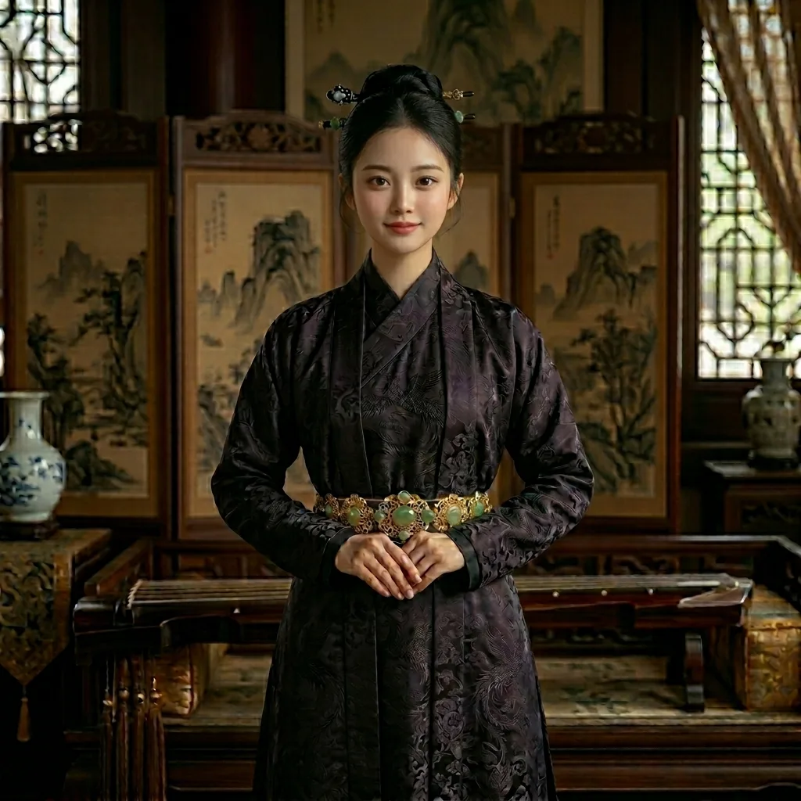

# 角色核心档案：【法统执剑人】—— 赵嬛嬛 (Zhao Huanhuan)

*   **大宋化名**：**大宋长公主 · 窃国天梯 · 皇权执剑者**

大宋长公主（帝姬），本是皇家最璀璨的琉璃，却在靖康之耻中被父兄当作求和的祭品。在看透旧时代的腐朽后，她选择背叛阶级，成为陆辰最冷酷的政治操盘手，手握传国玉玺，为未来的新文明铺设法理天梯。

---

## 〇、 姓名渊源与身份演变

*   **本名**：**赵嬛嬛**（huán huán）
*   **封号**：大宋长公主（帝姬）
*   **原型参造**：柔福帝姬 / 茂德帝姬（历史真实受难者结合体）
*   **年龄**：18岁（靖康之乱爆发时，于最美好的年纪被家国当作战利品献祭）

---

## 一、 角色形象：皇家琉璃与淬火之刃 (Appearance)

*   **视觉压迫**：长着一张大宋皇家审海底蕴的**清冷绝色**面容，举手投足间带着让凡夫俗子自惭形秽的纯高风华。
*   **绝色冰冷**：在看透父兄的虚伪后，其眉眼深处凝结了**深不见底的冰冷与狠戾**。看似如琉璃金丝雀般纤弱，实则审视权臣时散发的压迫感如淬毒冰刃。
*   **标志性装束**：严格恪守大宋皇家最高礼法，常着代表极品的**紫绀（深紫）**或**玄色**直领对襟长褙子。复杂的“蹙金工艺”绣着的双凤穿牡丹，在她身上呈现出如**金属锁子甲与刺荆棘**般的锐利质感。

---

## 二、 角色背景：被家国献祭的至高明珠 (Origin)

*   **背叛阶级的觉醒**：在被帝国抛弃于漫长的和亲之路时，她看透了大宋文官集团和门阀贪婪虚伪的嘴脸。她决定彻底背叛皇室特权阶层，蜕变为旧时代的“清算者”。
*   **屈辱的“和亲”**：作为“防武将、防外戚”宗法下的政治牺牲品，她在国家被敌方铁骑踩碎脊梁后，被懦弱父兄当成战利品，绑上了送往北方游牧帝国的绝望马车。
*   **钢铁的救赎**：在边境最惨烈的风沙中，目睹了男主率领铁骑将敌国迎亲队斩成肉泥。男主那降维打击般的冷酷暴力美学，让她看到了能砸碎屈辱的唯一“钢铁”。

---

## 三、 核心性格：极致冰冷的操盘手 (Personality)

*   **大逆不道的利益同盟**：她主动委身依附于被视为粗鄙军阀的男主，并利用正统皇室长公主的身份为其背书。
*   **狠辣的政治大脑**：深谙枢密院与相权的斗争规则，善于通过权谋、离间甚至暗杀，帮男主在朝堂内部合纵连横。
*   **冷血的“阳谋”**：她曾亲手操盘“盗取传国玉玺”并散发新帝“弑父篡位”铁证，迫使大宋分裂出五个伪帝，直接为男主创造了名正言顺“奉天平乱”的完美乱世修罗场。

---

## 四、 核心作用：窃国天梯与“双核互补” (Role)

*   **法理解锁器**：她是主角集团登顶宋朝最高权力的终极法理天梯。那块握在她手里的传国玉玺，是男主未来登顶帝位无懈可击的核心武器。
*   **与第一女主的完美协同**：
    * **商贾寡妇（陆晓晓）**：负责绝对忠诚的后勤、财政与工业统筹。
    * **权谋公主（赵嬛嬛）**：负责合法名分、朝堂内斗、情报系统与战略大局。
*   **政治大管家**：负责笼络士族与稳定大后方的政治生态。

---

> [!NOTE]
> **专家团批注（历史学家）**：她是本书中最尖锐的历史暗喻。通过打破“公主不干政”与“绝不和亲”的皇室虚梦，展现了文明由于软弱而付出的血泪代价。她在男主暴力系统中的法理地位，是本书后期大宋转变为“全球联邦”时极其关键的政治拼图。

---

## 附、 生平志 (Story Log)

*   **绍兴年间 · 腊月**：尚未正式登场。
*   **当前时间线轨迹**：正处于靖康之乱后的颠沛流离中，即将作为大宋长公主被卷入“和亲”北上的车队，命运齿轮尚未与主角对接。
*   **当前状态**：`[ ] 剧情待触发 (预计卷一后期登场)`

