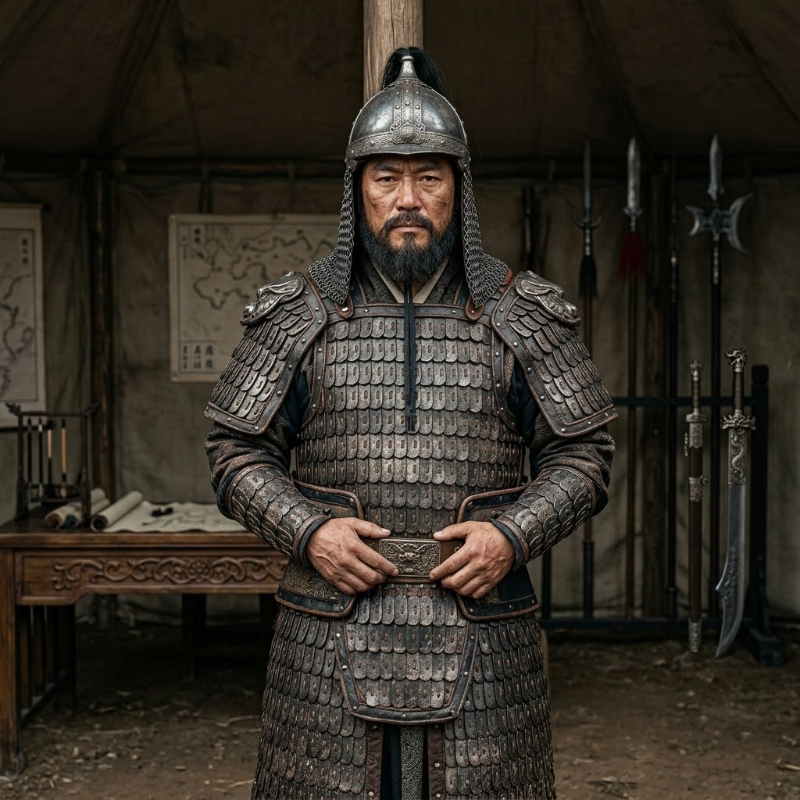

# 02_核心配角_将领_张宪

*   **本名**：**张宪**
*   **大宋化名**：**岳家军前军统制 · 铁血猛将 · 军事导师**

南宋抗金名将，岳飞麾下第一猛将。其军事素养极高，是陆辰进入南宋宏观战局的核心桥梁。在极度严谨的军职背后，他是一位真正的职业军人，也是陆辰在冷兵器战场上的引路人。

## 0. 角色定位 (Anchor)
- **身份**：【真实历史人物】南宋抗金名将，岳家军副统制（第一猛将）。
- **关系**：陆辰的参军引路人、军事导师。
- **叙事功能**：作为“职业军人”审视陆辰的怪物战力，是陆辰进入南宋宏观战局的核心桥梁。
- **状态**：绍兴十年时约为 30-40 岁，正处于军事生涯巅峰。

---

## 1. 物理参数与外貌 (Physical)
- **体格**：身形高大均衡，皮肤略显古铜色，手上有常年持重长枪的老茧。
- **神态**：目如朗星，极其沉稳，喜怒不形于色。
- **装备**：镔铁长枪、步人甲、腰跨短弩（根据史料还原）。

---

## 2. 行为特征与战斗风格 (Behavior)
- **军纪至上**：极其严谨，甚至在私下场合也保持着端正的坐姿。
- **识人之明**：他并不像一般武将那样崇拜“内功”或“神打”。他相信“唯快不破”和“极致的力道”，这正是他识别陆辰价值的逻辑支点。
- **战阵宗师**：擅长利用局部地形进行致命突袭。

---

## 3. 性格内核与冲突点 (Core & Conflict)
- **忠义铁律**：其忠诚不仅是对岳飞的，更是对“保境安民”这一大义的。
- **大义与愚忠的冲突**：在面对绍兴和议与莫须有罪名时，他的抉择将成为主角陆辰最大的心理冲击——是看着导师因忠义而死，还是用未来的手段粉碎历史。

---

## 4. 关键资产与势力关系 (Assets)
- **岳家军前军统制**：掌握精锐“前军”，是整个抗金战线最锋利的尖刀。
- **手环关联**：对陆辰手上的“次元手环”虽感奇异，但因陆辰立下的军功而从未试图剥夺，反而利用职权为陆辰打掩护。

---

## 5. 剧情 LOG (Chronicles)
- **绍兴十一年立春后（折冲右营检军）**：率五名亲兵抵达平江府折冲右营例行检军；大部分兵卒令其失望。在列队中停于陆辰面前，通过手掌肌群、筋腱判断其战斗经历，注意到左腕手环，未作追问。命亲兵钱翼对练，三十息后以陆辰胜结束；对陆辰首次开口仅问"在哪里打过仗"，接受"不记得了，但记得怎么打"的回答，未再追问。通过李德海将陆辰调配跟随折冲大营三月，随军家眷同往。
- **（待续）初试锋芒**：三月训练期中将见证陆辰更多战场表现。
- **（待续）正式收编**：将陆辰收入麾下，给予正式军职。

---

## 附：历史考据记录 (Research Notes)
- **[智囊团考据]**：张宪在《宋史》中记载较少但地位极重。他是岳飞最倚仗的人，连金人都说“撼山易，撼岳家军难”，而张宪正是那座“山”。
- **[写手团笔记]**：他必须是一个“沉默的英雄”，他不需要太多台词，他的存在感在于那份让主角陆辰都感到肃然起敬的职业素养。
