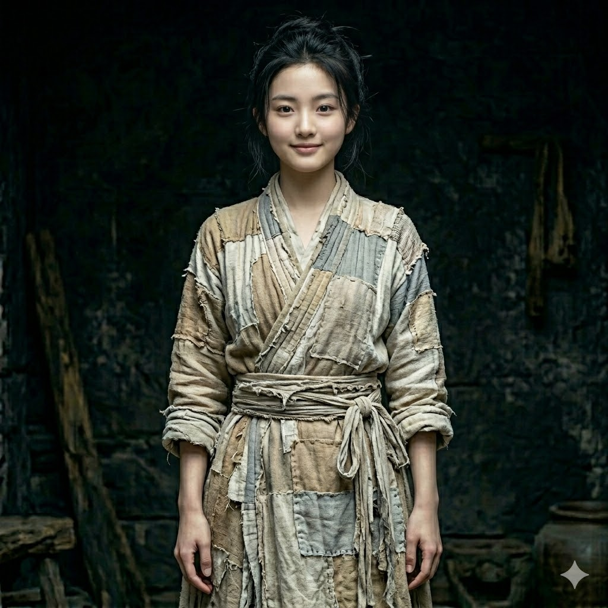

# 主要配角档案：陆晓晓 (第一女主)

## 〇、 角色基本信息
*   **姓名**：**陆晓晓**
*   **年龄**：19岁
*   **村人称呼**：张氏 / 张寡妇（因短暂许配给铁匠张铁所得）

## 一、 角色背景与身份痛点

*   **极致的悲剧开局（商贾千金被“吃绝户”）**：
    父母早亡，家道中落，她作为无依无靠的商贾千金被村里“吃绝户”。长相甜美、肤白貌美，与周围面朝黄土背朝天、五大三粗的农妇形成了极其鲜明而刺眼的对比。这种“格格不入的美丽”在失去父母庇护后，不仅没有换来怜香惜玉，反而招致了村里人无尽的垂涎与村妇恶毒的嫉妒。最终被贪财的远房婶婶收了银子，强行安排嫁给村里的铁匠**张铁**。
*   **人为的地狱与“克夫”恶名**：
    甚至连她那场悲惨的婚礼，都是一场充满乡野人性恶意的谋杀。在成亲的大喜之日，红烛刚燃，洞房未入，正是因为村里某些泼皮无赖对她的极致嫉妒与龌龊垂涎，**故意使坏将四处抓壮丁的州府官兵引到了她家**。凶神恶煞的官兵踹开家门，新郎张铁连夜被强行绑走充军，并在第二天就死在了前线的战场上。
    这场令人发指的阴谋得逞后，在这个宗族保守的宋代农村，年仅19岁的她反而被这帮人倒打一耙，指着脊梁骨唾骂为“白虎星”、“克夫”。她不仅守了活寡，沦为“张寡妇”，更成了一头跌入狼群、被这群施暴者贪婪注视着的绝境猎物。

## 二、 角色性格与生存羁绊

*   **被迫的坚韧与实用主义**：
    正是这种叫天天不应的绝境，逼出了她骨子里极度实用、甚至有些冷酷的求生欲。她被迫搬到了村子边缘（或靠近深山）的破屋里独自谋生。这也就是为什么她敢一个人进深山老林，并具备了把一具“死尸”背回家的巨大胆量。
*   **收留主角的核心动机（抓救命稻草）**：
    当她在深山发现浑身赤裸、毫无声息但肌肉极其强壮的主角时，她的第一反应除了怜悯，更多的是一种**疯狂的生存豪赌**。
    她太需要一个“男人”来撑起这个摇摇欲坠的家门了！哪怕是个来历不明的死尸，只要他能喘气，只要他能站起来，哪怕是个傻子哑巴，只要往院子里一站，村里那些半夜来踹她门栏的无赖恶霸、以及想“吃绝户”的刻薄叔伯，就得掂量一下！
*   **谎言与庇护**：
    为了能留下主角，她必然会对外（保长/里正）撒下弥天大谎，比如声称这是她远方来投奔的娘家远房表哥，是个因为逃荒而发烧烧坏了脑子、只知道干活的哑巴。

## 三、 剧情张力与冲突引爆点

*   **压迫与反弹**：
    寡妇试图用一个“傻大个（主角）”来维系脆弱的平衡，但她低估了封建乡村宗族的恶。当村长配合税务官吏前来“强暴征收结欠的丁税”，或者恶霸叔伯带着家丁强行闯入寡妇家，要把寡妇卖掉或者霸占房产时。
    寡妇被按在地上殴打、尖叫、流血。
    而那个一直在院子里呆呆劈柴、只会嘿嘿傻笑的“哑巴表哥（外星特种兵的主角）”，在看到鲜血的一瞬间，瞳孔骤然收缩，属于2056年绞肉机战场的极度杀戮本能（肌肉记忆）将被零帧唤醒。

## 专家团批注（历史学家）
*   这是对宋朝**“强行募兵/刺配充军”**与**“宗族吃绝户”**现象极其尖锐写实的刻画。将宋代底层百姓的血泪与科幻男主的降临完美咬合。寡妇的悲剧越深，主角第一次暴走拔刀时带给读者的“暴力复仇爽感”与“救赎感”就越具毁灭性。
