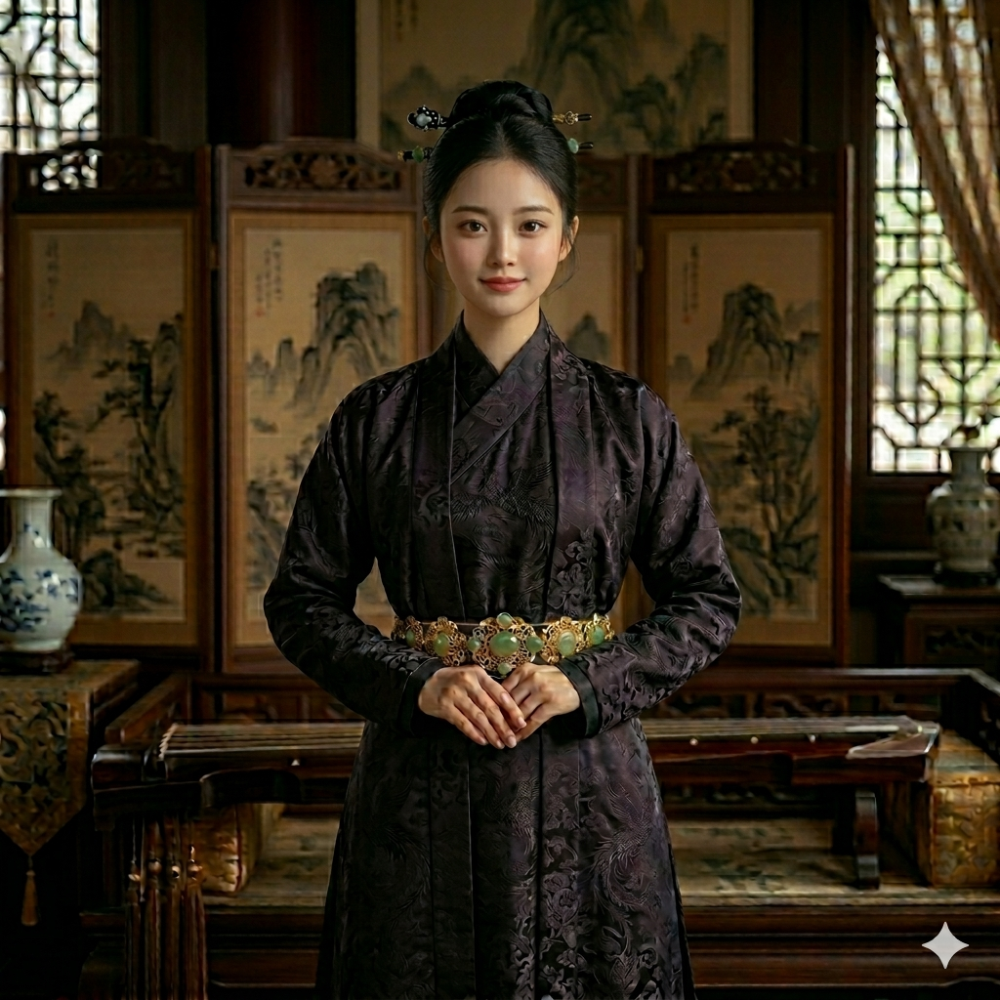

# 主要配角档案：赵嬛嬛 (第二女主·大宋长公主)

## 〇、 角色基本信息
*   **本名**：**赵嬛嬛**（huán huán）
*   **封号参造**：柔福帝姬 / 茂德帝姬（历史原型结合体）
*   **年龄**：18岁（靖康之乱爆发时，于最美好的年纪被国家当成战利品献祭）
*   **外貌特征（皇家琉璃与淬火之刃的结合）**：
    生着一张极具大宋皇家审美底蕴的**清冷绝色**面容。因从小受皇家最顶级的书画与礼乐熏陶，举手投足间带着一种让凡夫俗子自惭形秽的纯高风华。
    然而，在看透自己被懦弱父兄毫不犹豫当成祭品抛弃的帝国虚伪后，她原本温婉的眉眼深处，凝结出了一抹**深不见底的极致冰冷与狠戾**。身形看似纤弱得如同一碰即碎的琉璃金丝雀，但当她冷冷地审视那些朝堂权臣或布局杀伐时，那双美目中散发出的压迫感，如同一柄淬满剧毒的锋利冰刃。
*   **标志性常服与图腾（大宋最严苛的礼法规制）**：
    哪怕身处军营幕帐，她的着装依然**严格恪守大宋皇家最高礼法，绝无一丝杂乱与异族胡风**。常服多为代表极品的**紫绀（深紫）**或**玄色**的直领对襟长褙子，里面是极其服帖干练的交领窄袖。
    衣袍的图案完全遵照大宋长公主（帝姬）的规制，使用最奢华的**“蹙金工艺”**（冷金线盘钉），密密层层地绣着**“双凤穿牡丹”**或**“缠枝宝相花”**纹样。但因为底色极深，加之金线的光泽冰冷，这些本该象征太平盛世的繁花与双凤，在她身上却呈现出一种如同**金属锁子甲与带刺荆棘**般的锐利质感。**她把大宋最繁琐的礼教和高贵，当作了自己最坚不可摧的法理铠甲与武器**。

## 一、 角色定位与历史原型

*   **身份标签**：大宋最聪慧、最有政治手腕却被皇权无情献祭的皇家明珠。她不仅是一位公主，更是主角集团**登顶宋朝最高权力的终极法理天梯**。
*   **历史倒影（柔福/茂德帝姬结合体）**：在宋朝“防武将”、“防外戚”、“防公主干政”的严密宗法下，她原本是一只只能私下偷读《孙子兵法》和《商君书》、空有经天纬地之才却无处施展的高贵金丝雀。直到国家被敌方铁骑踩碎脊梁，懦弱的父皇（或兄长）为了苟延残喘，屈辱地打破了宋代开国以来“绝不和亲”的祖训，将她当成战利品，绑上了送往北方游牧帝国（金/辽）的绝望和亲马车。

## 二、 角色内核与转变

*   **背叛阶级的觉醒（门阀死敌）**：在被自己的帝国无情抛弃、漫长的流亡与和亲路上，她真正见识到了易子而食的民间疾苦。大宋的边关白骨累累，而临安的士大夫却在纸醉金迷。她终于看透了大宋文官集团和世家门阀那张虚伪贪婪的面皮——这些满口仁义道德的士族，全都是趴在百姓脊梁上吸血的魔鬼蛀虫。这种刻骨铭心的痛恨，让她彻底背叛了自己的皇室权贵阶层，蜕变成了一个极度冰冷坚定的“旧时代清算者”。这也是主角集团绝不与旧门阀妥协、誓要“革他们的命”的最强精神与法理内核。
*   **血色抢亲（崇拜与效忠的锚点）**：在边境最惨烈的风沙中，男主率残暴的铁骑强行拦下了和亲队伍，当众将飞扬跋扈的敌国迎亲特使与其重甲护卫队全部斩成肉泥、削首踩碎。男主那跨越历史的极度冷酷、兵器降维打击以及如同怪物般的暴力美学，让这位对大宋军人彻底绝望的公主，震撼地看到了**世界上唯一一块能砸碎屈辱和斩裂天穹的“钢铁”**。
*   **大逆不道的利益同盟**：她没有回那座懦弱的宫廷哭诉。她选择以最高贵的皇室之躯，主动委身依附于这个被全天下视为粗鄙军阀的“武夫（男主）”。她将用自己正统皇室长公主的合法身份和超高的政治手段，成为男主军阀割据之路上的最强政治背书。

## 三、 登顶天梯：在主角集团中的核心作用

*   **洗白军阀与窃国黄雀（法理解锁器绝杀）**：男主再能打，公然抢地盘也只能算土匪军阀。而这位公主，是从深渊里爬出来的最高级战略操盘手。**震惊天下的“盗取传国玉玺”与向全天下散发新帝“弑父篡位”铁证的极限阳谋，正是出自她一手安排的死士之手！** 她用最狠辣冰冷的一招，直接抽空了新帝的合法性底座，让他一登基就变成众矢之的和孤家寡人，成功逼迫大宋分裂出五个伪帝。这就给主角创造了一个完全不受中央节制、名正言顺“奉天平乱”抢地盘的完美乱世修罗场。而那块握在她手里的传国玉玺，将是男主未来登顶帝位最无懈可击的法理核武！
*   **大宋朝堂的最高级操盘手**：她深谙宋代枢密院（最高军事机构）和相权（文官集团）的内斗规则。男主在前线用滑膛枪和唐横刀平推四方，而她则坐在后方的幕帐里，通过密信、权谋、离间甚至暗杀，帮男主在朝廷内部合纵连横，把那些想暗算断粮的主和派宰相和将领玩股掌之上。
*   **与第一女主（商贾寡妇）的完美“双核互补”**：
    *   **商贾寡妇（患难发妻）**：负责绝对的忠诚底线、后勤钱粮、土法兵工厂的统筹与民生商业（主角集团的**财政与工业大管家**）。男主在微贱时期的唯一依靠。
    *   **权谋公主（平妻/贵妃）**：负责大义名分、朝堂内斗、情报机构（皇城司的暗子）、笼络士族与战略大局（主角集团的**政治与法理大管家**）。
    两人一内一外，一商一政，构建了主角无坚不摧的幕僚后宫系统。
